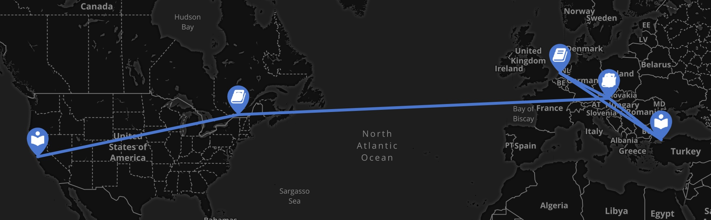

<body style="background-color:#EAF9F3;">

{width=100%}
[Click here to follow my academic path on Maphub](https://maphub.net/lisateichmann/Academic-Roadmap)

I am originally from Austria, my native language being German, but I also speak French, Turkish, some Farsi and Russian. I have a Bachelor's degree in Middle Eastern Studies from the University of Vienna. For my BA specialized in Turkish language and literature and also took courses at Bogazici and Istanbul University. During my Master's degree, which I did at Leiden University, I focused my research on urbanization and its literary representation in Turkish fiction.
 

In 2015 I started a PhD at McGill University with Andrew Piper as my supervisor, as a NovelTM fellow, assistant editor of [Cultural Analytics](https://culturalanalytics.org), and lab member at [txtlab](https://txtlab.org). I increasingly got interested in translation trajectories and their geographic mapping, as a result of which I finished my thesis "Mapping German Fiction in Translation in the German National Library Catalogue (1980-2020)" in December 2022.
 
Since April 2023 I am a postdoctoral fellow at the Centre de recherche interuniversitaire sur les humanités numériques (CRIHN), Université de Montréal. I work on testing my quantitative model for translationalism, literary transfer, and canonicity on data from  national collections.

----

