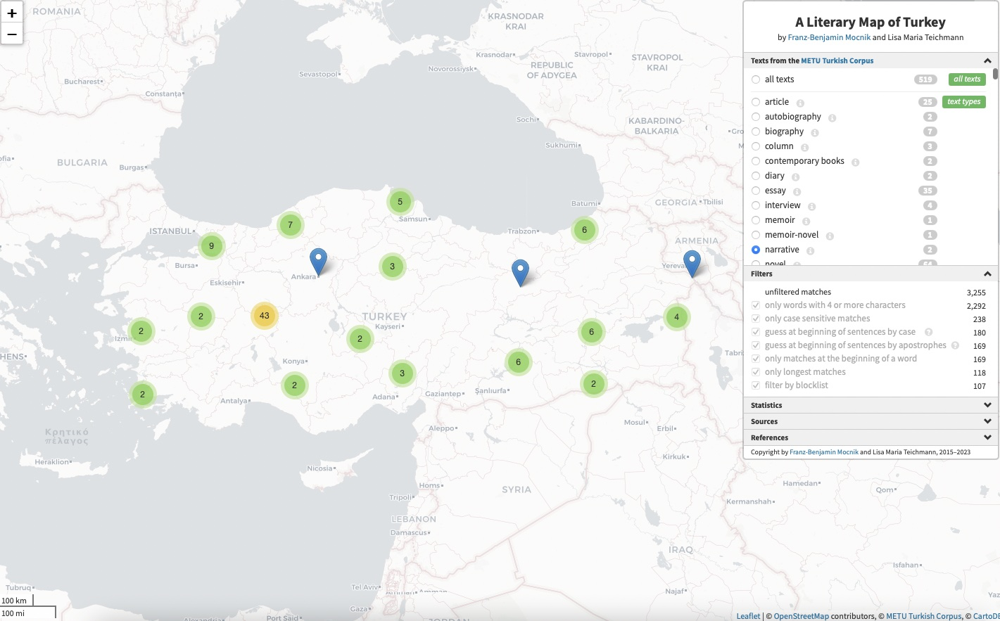

<body style="background-color:#EAF9F3;">
<br>

### Mapping German fiction in translation in the German National Library catalogue (1980-2020)

This thesis project is dedicated to making translations visible and disentangling the roles of the author, place of publication, and language in carving the paths that German fiction travels in the world of literature. These channels of transfer are documented in archives of national literatures and this project presents an unprecedented study of translated German fiction by sourcing bibliographic data of translations from the German National Library. It is a first attempt at utilizing the wealth of data openly accessible through the library catalogue and at designing, exploring, and testing a quantitative model of analysis for German fiction in translation, drawing on social network analysis, descriptive statistics, and geomapping. By analyzing the role certain languages and authors play in the field of translation, this thesis investigates which works of fiction and authors are overrepresented and which ones are marginal in the translation network. This thesis builds on the notion of translationalism—that certain authors set themselves apart by connecting several linguistic communities in geographic space—as a driving force behind the literary transfer of translations. Translationalism, as argued here, invites the reader to re-evaluate what is categorized as world literature by drawing attention to the role of the national canon and the national collection in the global circulation of German fiction in translation.

**For scripts and the thesis appendix consult the [Github repository](https://github.com/lisateichmann/Mapping-German-Fiction-in-Translation).**
<br>
**Read my thesis [here](https://escholarship.mcgill.ca/concern/theses/0p096d03z).**
<br>

----

### Geomapping bibliographic Translation data from the German National Library Catalogue: A Casestudy

Prototype for visualizing bibliographic data for translations extracted from the German National Library catalogue in geographic space in [Shinyapp](https://lt-ladirec.shinyapps.io/GeomappingTranslationsPrototype/).
This work has been presented as a [poster](https://doi.org/10.5683/SP3/VNUEP0) at the Spatial Humanities Conference in Ghent in 2022.
<br>
**Code and script [Dataverse](https://doi.org/10.5683/SP3/VNUEP0)**
<br>

```{r setup, include=FALSE}
knitr::opts_chunk$set(echo = TRUE)
```

<iframe width="100%" height="150px" src="https://lt-ladirec.shinyapps.io/GeomappingTranslationsPrototype/" title="Geomapping Casestudy" data-external="1"></iframe>

----

### A Literary Atlas of Turkey

An [interactive map for toponyms extracted from the METU Turkish corpus](http://projects.mocnik-science.net/literary-map-of-turkey/) (co-authored with Franz-Benjamin Mocnik)



<br>

----

### Romans à lire: données bibliographiques de BANQ

Co-autrice avec Pascale Brissette et Julien Valliéres
<br>
Description de la base de données Romans à lire, une ressource de Bibliothèque et Archives nationales du Québec (BANQ). Cette base de données peut être consultée à travers l’interface web disponible sur le site de BANQ, mais on ne trouve sur ce site aucune information sur la genèse et les paramètres de la base. La description que nous en proposons vise à combler cette lacune et à permettre son utilisation en contexte de recherche; elle est issue, d’une part, d’informations obtenues auprès de la direction de BANQ, d’autre part d’analyses statistiques menées à partir d’une copie de la base remise aux auteurs le 23 janvier 2023. BANQ interdit le partage de cette copie et nous ne pouvons donc la rendre publique; cependant, la base elle-même peut toujours être consultée en ligne. Cette collection documentaire contient une note de recherche au titre éponyme, des tables de données, des diagrammes et des scripts R. Les statistiques fournies dans la note de recherche, les scripts R qui ont servi à produire ces statistiques ainsi que les diagrammes peuvent être reproduits et utilisés librement.
<br>
**[Dataverse](https://doi.org/10.5683/SP3/HMSNVE) pour Rapport et statistiques descriptives**

----

### Press corpus of food-related articles for Montreal (English and French)

For this project I worked on the document classification using a Random Forest machine learning algorithm for the English language corpus. The main objective was to classify food-related articles. The resulting corpus has been published in TFI/DF format and is available for text analysis.

<br>
**[Corpus Github repository](https://github.com/LADIREC/recitsfaim) (24 752 French articles andc9 194 English articles in TFI/DF format**
<br>
**[Code Github repository](https://github.com/LADIREC/classification_corpus_mediatique_alimentation_partage)Scripts for the document classification of food-related media article with Random Forest**


